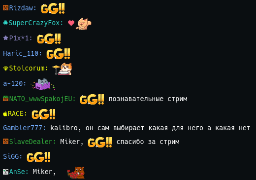
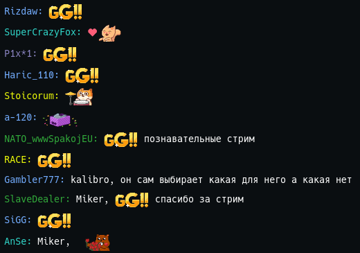
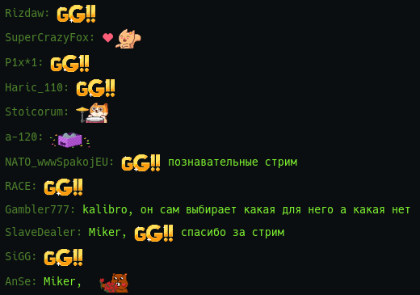

# gg_stuff

Коллекция всякие полезных твиков для сайта GoodGame.ru

Предназначена в основном для стримеров, но это пока.

# CSS стили для вывода чата на экране OBS

Позволяет вывести чат на экран без лишних элементов и настроить его
внешний вид.

## Файлы стилей:

[Инструкция по добавлению чата в OBS и настройке](docs/gg_chat_obs.md)

Обычный чат [css/default.css](css/default.css)

Обычный чат без значков пользователей
[css/default_no_icons.css](css/default_no_icons.css)

Перекрашенный чат [css/recolor.css](css/recolor.css)

Перекрашенный чат без значков пользователей
[css/recolor_no_icons.css](css/recolor_no_icons.css)

# Информация для разработчиков

Является строго секретной и [находится тут](docs/developer.md)
