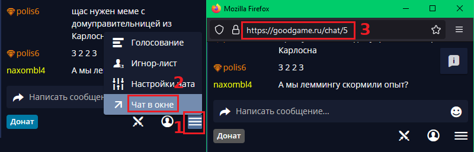
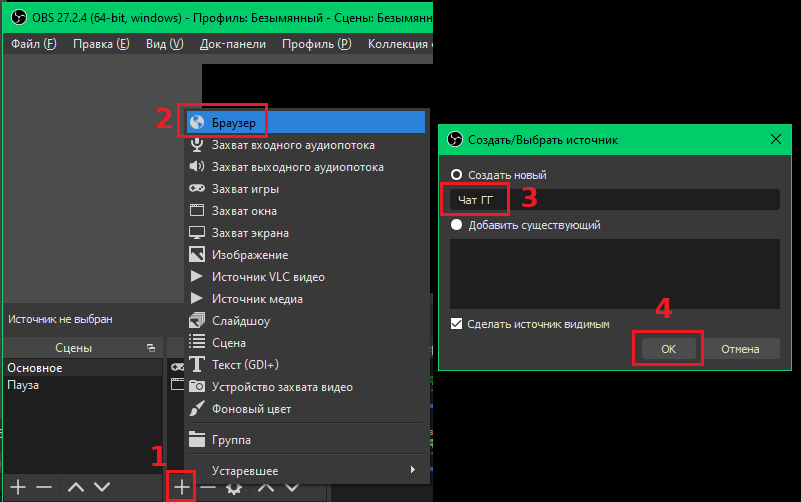
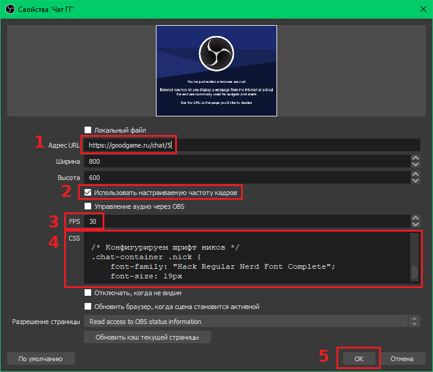
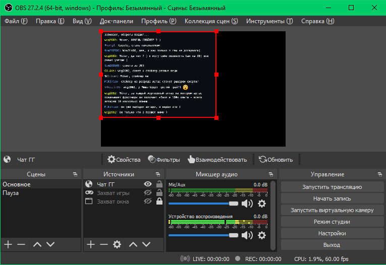
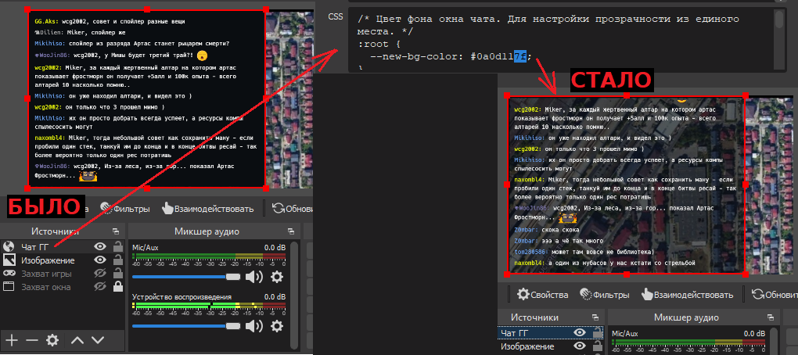
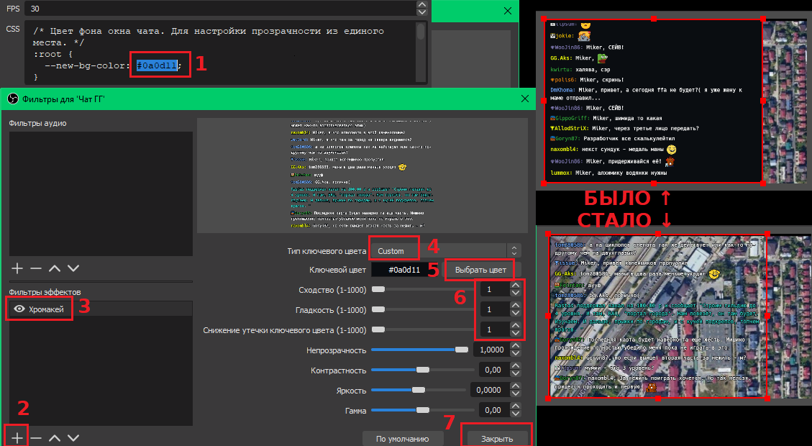
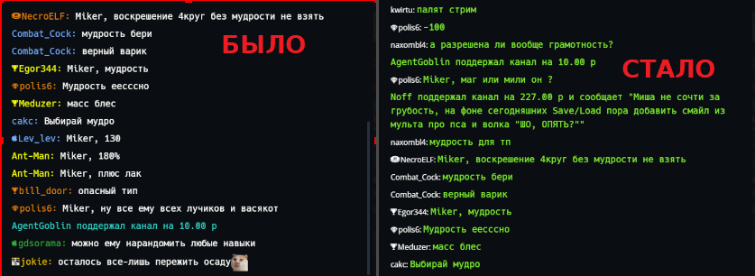

# CSS стиль для вывода чата на экране OBS

Позволяет вывести чат на экран без лишних элементов и настроить его
прозрачность.

Файл стиля: [gg_chat_obs.css](../gg_chat_obs.css)

## Дисклеймер

Настройки чата собьются в тот момент, когда команда GG поменяет
что-нибудь в оформлении, например вернёт белый GG.

## Инструкция по добавлению чата на экран

В браузере открываем чат канала в отдельном окне. В правом нижнем углу
чата нажимаем полосатую кнопку "Меню чата", затем "Чат в окне". Копируем
из нового окна ссылку на чат.



В OBS в поле "Источники" нажимаем плюс и выбираем "Браузер". Выбираем
ему название и делаем видимым и нажимаем "ОК".



Откроется окно свойств источника. В поле "Адрес URL" вставляем ссылку на
чат.

Ставим галку "Использовать настраиваемую частоту кадров", откроется поле
"FPS", там выставляем какое-то значение, например, "30".

В поле "CSS" вставляем содержимое файла `gg_chat_obs.css` и жмём "ОК".



После этого чат должен появиться на экране.



## Прозрачный или полупрозрачный чат средствами CSS

В файле есть переменная `--new-bg-color`. Её значение кодирует фоновый
цвет блоков чата.

Она задаётся в
[формате #rrggbb](https://www.w3schools.com/colors/default.asp), где:

- `rr` - красная составляющая цвета (от `00` - минимум до `ff` -
максимум),
- `gg` - зелёная составляющая цвета (от `00` до `ff`),
- `bb` - синяя составляющая цвета (от `00` до `ff`).

или в
[формате #rrggbbaa](https://www.w3schools.com/colors/default.asp), где:

- `aa` - прозрачность (от `00` - прозрачный до `ff` - непрозрачный)

Все значения в шестнадцатеричной системе счисления.

Таким образом, меняя значение составляющей aa, можно добиться
прозрачности или полупрозрачности чата. Если составляющая `aa` не
задана, то считается, что она равна `ff` (непрозрачный чат).

Для примера:

- `00` - прозрачный чат,
- `3f` - прозрачность 75%,
- `7f` - прозрачность 50%,
- `be` - прозрачность 25%,
- `ff` - непрозрачный чат.



## Прозрачное окно чата средствами OBS

Прозрачность настраивается в OBS через фильтр "Хромакей". Для этого надо
выбрать источник с чатом и добавить туда фильтр.

В настройках фильтра выбрать свой цвет для прозрачности, его значение
нужно посмотреть в файле gg_chat_obs.css, он задан в самом начале в
переменной `--new-bg-color`, надо взять первые три октета
(например, `#0a0d11`).

Задать параметры "Сходство", "Гладкость", "Снижение утечки ключевого
цвета" значением "1".



## Отрисовка имён пользователей и текста одним цветом

Иногда для каких-то стилистических целей хочется, чтобы чат был не таким
пёстрым и имена рисовались единым цветом. И заодно сменить цвет текста.

Для этого в файл стиля добавлены две переменные:

- `--nick-color` - задаёт цвет имён пользователей
- `--message-color` - задаёт цвет текста и донатов в чате

В самом файле есть две секции, которые изначально закомментированы:

```
/* Настройка цвета текста в чате */
/*
.chat-container .message-block .message,
...
p[_ngcontent-sud-c7] {
    color: var(--message-color);
}
*/

/* Настройка цвета ников в чате */
/*
.chat-container .nick.simple,
...
your-nick {
    color: var(--nick-color);
}
*/
```

Надо их раскомментировать (обе или только одну - по вкусу):

```
/* Настройка цвета текста в чате */
.chat-container .message-block .message,
...
p[_ngcontent-sud-c7] {
    color: var(--message-color);
}

/* Настройка цвета ников в чате */
.chat-container .nick.simple,
...
your-nick {
    color: var(--nick-color);
}
```

после этого имена и сообщения будут рисоваться выбранными цветами.


